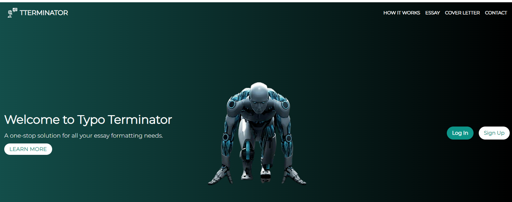

# Tutor Terminator
# Features
Essay editing and areas of improvement. Cover Letter Generator

********************************
ChatGPT is the model used: gpt-turbo-301 but the next model is super fast and is expected next month. This will reduce the response from the API from 6-7 seconds to 1-2 seconds.

# Child Safety Features
DOUBLE LAYER OF PROTECTION for child users. User enter text is sent though a moderation engine to check for any sexual, violent or other inappropriate text. Only if it passes that check will it get a response from the AI. A second level of validation is added to the AI's response which is also checked for safety content.

# Play with Me

https://typoterminator.herokuapp.com/
## Steps:

1. Clone this repository:

git clone 

2. Install dependencies:

npm install

3. Add API key: Replace YOUR_API_KEY with your OpenAI API key in the .env.example file and then rename it to .env

4. Start the development server:

npm run dev

5. Deploy to Heroku: Follow the steps provided by Heroku to deploy your application.
